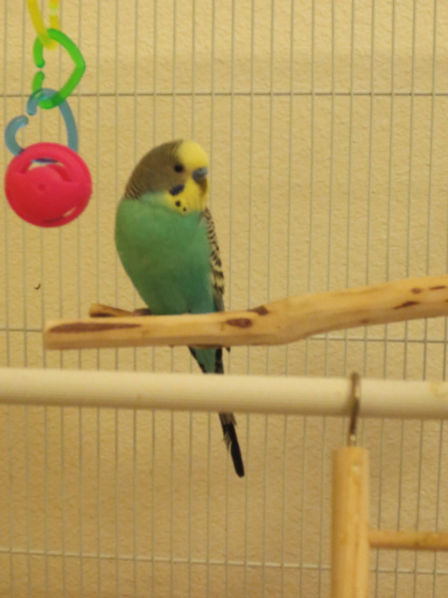

## Katie Hsieh

[Hello there!](test.md) I'm a second year student studying computer engineering.


### Skills

- C++/Qt
- Java
- C
- Python
- HTML/CSS
- MATLAB
- SQL
- Arduino
- CircuitPython


### Hobbies

1. **Playing and learning musical instruments**
  - Piano
  - Percussion
  - Ukulele
  - Guitar
  - Kalimba
2. **Learning Swift and iOS app development**
3. **Playing Animal Crossing**
4. **Crochet**
  - [Yarn Plushies](https://yarnplushies.com/)
5. ~~Baking~~


### Daily To-Do List

- [x] Eat
- [x] Code
- [x] Study
- [ ] Sleep


***Quote of the day***

> Start early, start often


### Meet My Bird




### Quick Markdown Guide

```markdown
Syntax highlighted code block

# Header 1
## Header 2
### Header 3

- Bulleted
- List

1. Numbered
2. List

**Bold** and _Italic_ and `Code` text

[Link](url) and 
```

For more details see [GitHub Flavored Markdown](https://guides.github.com/features/mastering-markdown/).
